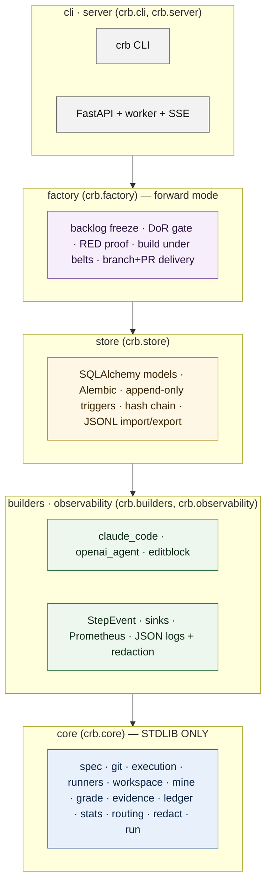
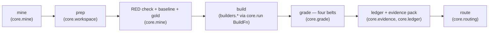

# Commit Replay Bench (`crb`)

**Commit Replay Bench** grades an AI builder against a repository's **own held-out tests**.
Its verdicts do not come from a model's opinion of a model's work: every verdict is the
result of the **mechanical belts** run over the repository's real test suite and its own lint
gate (belt set v5 — each belt is defined in
[Evidence & claims §2](docs/EVIDENCE-AND-CLAIMS.md#2-clean-semantic-q1-and-false-q1)), and the
product refuses — at the moment of writing — to record a pass that any belt contradicts
(**false-Q1 = 0**, enforced in `GradeResult.__post_init__` and `GradeRow.assert_invariants`).
Every verdict is written to an **append-only, hash-chained ledger** with a per-task
**evidence pack**, and every number the product displays carries its sample size `n`, a
Wilson 95% interval, and the version of the apparatus that produced it. On that evidence
it **routes** each class of change to `deliver` / `calibrate` / `granularize` / `human`, and
manufactures new work under the same governance.

**What the product is** (DL-044): the **factory** — new changes delivered as branches and
pull requests only in the cells the evidence licenses — and the **self-improvement loop**
that turns every refusal, review and re-measurement back into a better next run. Connecting
a repository, measuring it and signing a cell off is the on-ramp that earns the baseline
those two run on. And the end state is a framework the teams using it improve: every
builder, runner, control, review probe, readiness slot and policy is a documented seam, the
loop runs on `crb`'s own repository, and what one team learns reaches another only as
abstract cells, never code.

> Status: **2.0.0a1 on `main`, 2.0.0b1 in preparation** (apparatus **2.2**, belt set v5) — a public, Apache-2.0
> repository since 2026-09-16 with **CI green on `main`** — every job in
> [`.github/workflows/ci.yml`](.github/workflows/ci.yml) runs on every pull request, and
> branch protection requires the ten checks on its required list before anything merges;
> every other job — `sbom`, `sandbox-images` and each gate added since, this wave's `dod`,
> `claims`, `ui-unit` and `ui-smoke` among them — runs on every pull request but is not on
> that list, which only
> an administrator of the repository can change
> **[measured 2026-09-22 — the required-checks list read once from the repository setting
> (`gh api …/branches/main/protection`) against the workflow's job keys, n = 1 reading;
> apparatus n/a: a repository setting, not a graded number]** — and every change since
> 2026-09-15 reviewed by CodeRabbit (ADR-0013). Every phase of the product plan has shipped (P0–P7: engine, oracle,
> builders, store, server, UI, factory, deployment) plus the MCP server (P8) so Claude Code
> can drive a deployment. `v2.0.0a1` is tagged and its image is on GHCR; `v2.0.0b1` will be
> cut per [docs/RELEASING.md §2](docs/RELEASING.md#2-cut-a-release) once the shippable wave
> (user lifecycle, the hint layer, the loop closing on a merge) is on `main`, when the release
> workflow builds, smokes and signs its image. See [Status by phase](#status-by-phase) and the
> [Changelog](CHANGELOG.md). The June 2026 v1 contents are tagged `v1.0.0-legacy`.
>
> Releases: a release is a `v<package-version>` tag on `main` (`v` + the PEP 440 version
> in `pyproject.toml`, pre-release suffix included: `v2.0.0b1`) — one version in three
> files plus a dated CHANGELOG section, then the pipeline builds, smokes, SBOMs and keyless-signs the image on
> GHCR. Both halves of "on `main`" are enforced by the release workflow before anything
> is built: `scripts/check_release_tag.py` refuses a tag whose name is not `v<version>` and
> a tag whose commit is not reachable from `origin/main`, so an unmerged commit can be tagged
> but never published or signed. How a release is cut and what to check: [docs/RELEASING.md](docs/RELEASING.md).

## Start here

| You are… | Read, in this order |
|---|---|
| **Anyone** — what is this and what does it claim? | the one-page [**explainer for practitioners**](https://claude.ai/artifact/DUaMMWkMXGk25djQYLfZQk) (how it works, the mechanics an expert will ask about, what has been measured, what it refuses to claim) → this page → [Evidence & claims](docs/EVIDENCE-AND-CLAIMS.md) → the [NHS measurement](docs/reviews/2026-09-14-nhs-public-repos.md) |
| **A developer** taking it to a client's repository | [Onboarding a repository](docs/ONBOARDING-A-REPO.md) (or the UI's *Connect* walk) → [Operator guide](docs/OPERATOR.md) → [API](docs/API.md) → [MCP server](docs/MCP.md) (drive it from Claude Code) → [Code map](docs/CODE-MAP.md) |
| **A developer** changing the product | [Architecture](docs/ARCHITECTURE.md) → [ADRs](docs/adr/README.md) → [Code map](docs/CODE-MAP.md) (every file's header says what it is, what proves it, when you touch it) → [Contributing](docs/CONTRIBUTING.md) |
| **Governance / assurance** | [Evidence & claims](docs/EVIDENCE-AND-CLAIMS.md) → [Security](docs/SECURITY.md) → [Data retention](docs/DATA-RETENTION.md) → [Licensing](docs/LICENSING.md) → the [decision log](docs/DECISION-LOG.md) and the [reviews](docs/reviews/) (an independent critical-friend review, two independent decider passes, an [external assessment answered from the source](docs/reviews/2026-09-16-external-assessment.md), the [instrument pointed at its own repository](docs/reviews/2026-09-16-dogfood.md) the [enterprise front-end research brief](docs/reviews/2026-09-17-enterprise-front-end.md) the [persona walkthrough on a live stack](docs/reviews/2026-09-17-persona-walkthrough.md) an [assessment of four external documents](docs/reviews/2026-09-17-external-documents-assessment.md) and the [first real factory pull requests](docs/reviews/2026-09-19-b1b-first-factory-pull-request.md) are on record) |
| **An operator** deploying it | [Deployment](docs/DEPLOYMENT.md) → [Operator guide](docs/OPERATOR.md) |

Related documents: [Explainer for practitioners](https://claude.ai/artifact/DUaMMWkMXGk25djQYLfZQk) ·
[Architecture](docs/ARCHITECTURE.md) ·
[Evidence & claims policy](docs/EVIDENCE-AND-CLAIMS.md) · [ADRs](docs/adr/README.md) ·
[Operator guide](docs/OPERATOR.md) · [Onboarding a repository](docs/ONBOARDING-A-REPO.md) · [MCP server](docs/MCP.md) ·
[Code map](docs/CODE-MAP.md) · [Contributing](docs/CONTRIBUTING.md) ·
[Decision log](docs/DECISION-LOG.md) · [Changelog](CHANGELOG.md)

---

## Who it is for

A **regulated organisation that self-hosts it** — the design customer is an NHS
organisation. `crb` is deployed inside the customer's own tenant, **BYOK** (bring your own
model keys). Nothing leaves the tenant except the calls to the model endpoint the operator
configures (for example Azure OpenAI in the same tenant, or a local model). Repository
tests run in a **fail-closed** container sandbox with no network; test output is redacted
and capped before it is stored; raw diffs and builder transcripts are **not retained by
default**.

## What it is not

- **Not a leaderboard.** There is no public ranking and no shared score. Each deployment
  measures its own repositories, and a measured cell says nothing about a cell that was not
  measured.
- **Not an AI opinion of AI work.** No model reviews, approves or scores a change. The only
  judge is the repository's own test suite, run mechanically under the belts below. Where a
  suite is too weak to judge (a weak oracle), the product says so and routes to a human
  rather than pretending.
- **Not a proof of semantic correctness.** A green suite proves the change satisfies the
  suite. `clean` is a mechanical result. See [EVIDENCE-AND-CLAIMS](docs/EVIDENCE-AND-CLAIMS.md)
  for what may and may not be said on that basis.
- **Not a licence to deploy.** `deliver` is a route for a *class* of change in one
  repository: its measured cell clears the published bar (n ≥ 10, point ≥ 0.90, Wilson-low
  ≥ 0.80, false-Q1 = 0, oracle ≥ 0.80, controls passed), so the factory may open a branch
  and a pull request for such changes under human review — and only for such changes: the
  map gates the factory ([ADR-0003](docs/adr/0003-one-routing-rule.md), amendment
  2026-09-16). It never means a change is safe to merge or deploy unattended; a human
  merges, and the measurement says nothing about security, operations or business fit.

---

## The belts (four core, plus the repository's own gate)

A trial (the commit's parent plus the builder's edits) is `clean` **only if every evaluated
belt holds** (`crb.core.grade.BELT_NAMES`; apparatus 2.2 = belt set v5):

| # | Belt | What it checks | How |
|---|------|----------------|-----|
| 1 | `tests_unmodified` | The builder did not move the goalposts. | Every target test file is **byte-identical** to the real commit's version (`git diff <sha>` + SHA-256 compare). A modified oracle **disqualifies** the trial. |
| 2 | `target_green` | The previously-RED target tests now pass. | The runner executes the target scope; timeouts are failures. |
| 3 | `no_new_failures` | Nothing else broke. | The regression belt scope is run and compared with the **baseline failing set** captured at the parent; unattributable output (compile error, crash) fails the belt. |
| 4 | `source_changed` | The pass is real, not a build-cache ghost. | The diff against the parent touches at least one non-test file. |
| 5 | `repo_lint_clean` | The repository's **own** formatter / linter / type checker accepts the changed files. | `prettier`, `eslint`, `tsc`, `ruff`, `gofmt`, `spotless`, `cargo fmt` … at the version the commit pins ([ADR-0011](docs/adr/0011-repo-lint-belt.md)); *not evaluated* when the repository configures none — never a silent pass. Belt 1 also covers test infrastructure (`conftest.py`, `jest.config.*`, lockfiles). |

Everything else **fails closed**: a harness error, sandbox failure or timeout is recorded as
a non-pass, never a silent pass; a malformed oracle (a "test" file with no tests) or a
tampered test file is **disqualified** — excluded from the denominator, not counted either
way. `GradeResult.__post_init__` raises `FalseQ1Violation` if any code path tries to construct
`clean=True` with a belt that is not `True` — see [ADR-0001](docs/adr/0001-four-belts-and-false-q1-at-write.md).

## Modes: sighted and blind

| Mode | What the builder sees | Extra check |
|------|-----------------------|-------------|
| `sighted` | The parent checkout **with the target tests overlaid** (it knows what must pass). | Belt 1 proves it left them byte-identical. |
| `blind` | The parent checkout and a description only; the held-out tests are overlaid **at grade time**. | Belt 0 (blind only): if the builder touched *any* test file before the overlay, the trial is disqualified — the overlay would otherwise silently erase that edit. |

In **neither** mode does the builder see the regression belt or the grader. See
[ADR-0004](docs/adr/0004-builder-registry-sighted-and-blind.md).

## The instrument in six steps

1. **Mine** — walk the repository's history for commits that couple a source change with a
   test change within the pool's size caps (`standard` / `hard`).
2. **Prep** — create a disposable git worktree at the commit's **parent**; overlay the
   commit's test files.
3. **RED / baseline / GOLD check** — the target tests must **fail** at the parent (and not
   time out); the belt scope's pre-existing failures are recorded as the **baseline**; then
   the commit's own sources are overlaid and must turn the target green with no new belt
   failures (**gold**). A commit whose gold does not pass cannot judge a builder and is
   excluded from statistics (`gold_clean=False`).
4. **Build** — the configured builder edits a fresh worktree (sighted or blind) under a
   turn/token/cost budget. It never receives the grader.
5. **Grade** — the belts run inside the sandbox; the result is a `GradeResult` that
   cannot be `clean` with a failed belt.
6. **Ledger** — the evidence pack is hashed; a `GradeRow` carrying that hash is chained to
   the previous row and appended (no pack ⇒ no Q1). Cell statistics and the routing rule
   read from the ledger, never from a builder's self-report.

---

## Quickstart

> The CLI surface below is the P1/P2 contract. Commands are listed in pipeline order; the
> status table says which phase delivers each one.

```bash
# Python ≥ 3.12; git on PATH; docker for the sandboxed executor.
pip install -e '.[dev]'            # or: uv venv .venv --python 3.12 && uv pip install -e '.[dev]'

crb repo add   myrepo --path /srv/repos/myrepo --language python --runner pytest \
               --sandbox-image ghcr.io/example/myrepo-toolchain:2026-09
crb repo probe myrepo              # proves the toolchain: runs a known-green scope in the sandbox
crb mine       myrepo --pool standard --target 25    # RED-check, baseline, gold-check → tasks
crb grade      myrepo --builder editblock --mode sighted   # build + the belts → evidence packs + ledger rows
crb ledger verify                  # walks the hash chain; exit 1 on any break
crb ledger stats --repo myrepo     # per-cell n, clean, point, Wilson CI, false-Q1 (must be 0), cost, latency
crb route      --repo myrepo       # the ONE routing rule applied to each measured cell, with its reason
```

Library use (stdlib only — `crb.core` imports nothing outside the standard library):

```python
from crb.core.spec import RepoConfig, Language
from crb.core.git import GitRepo
from crb.core.runners import get_runner
from crb.core.execution import DockerExecutor, DockerSettings
from crb.core.mine import mine
from crb.core.grade import grade
from crb.core.ledger import JsonlLedger, GradeRow, all_cell_stats
from crb.core.routing import route

config = RepoConfig(name="myrepo", language=Language.PYTHON, sandbox_image="myrepo-toolchain:2026-09")
executor = DockerExecutor(DockerSettings(image=config.sandbox_image))   # raises SandboxUnavailable if it cannot isolate
runner = get_runner(config)
```

## Architecture

Layers depend **downward only**; `crb.core` is standard-library only. Both rules are enforced
by `import-linter` in CI ([ADR-0008](docs/adr/0008-stdlib-core-and-downward-layers.md)).



The run pipeline, with the module that owns each stage:



`core.run` orchestrates prep → build → grade → evidence → ledger per task, one ledger row
per attempt, with the builder injected as a callable.

Full description, C4 diagrams, sequence diagrams and the data model:
[docs/ARCHITECTURE.md](docs/ARCHITECTURE.md).

## Evidence & claims policy

Every claim in this repository carries one of these tags:

| Tag | Meaning |
|-----|---------|
| `[measured]` | Backed by ledger rows you can re-derive: `n`, method, Wilson interval, apparatus version. |
| `[hypothesis]` | Directionally supported; not yet confirmed by a pre-registered or replicated measurement. |
| `[aspiration]` | Designed for; not demonstrated. |
| `[gap]` | Named as missing, so a reader is never left to assume it is there. |

The rule is a gate, not a habit: CI's `claims` job (`scripts/claims_check.py`) reads the pages
on its allowlist, finds the sentences that quantify something, and fails when one carries no
tag — or when a `[measured]` one carries no `n`, no method and no apparatus version. The
script's own docstring says what the heuristic deliberately does not catch, and which pages
are not yet covered.

**A number without its method is a slogan.** Every figure the product shows carries its
`n`, its confidence interval and its apparatus version; numbers from different apparatus
versions are reported separately and never blended. The full policy — the severity ladder
for false-Q1, the apparatus stamp, the legacy-belt caveat on the census ledger, and the
permitted claim shapes at each maturity — is in
[docs/EVIDENCE-AND-CLAIMS.md](docs/EVIDENCE-AND-CLAIMS.md).

## What has been measured (2026-09-15) — and what it licenses

Everything below is **[measured — each bullet names its corpus, its mode, its builder and
its budget, and every row behind it is in the ledger and re-derivable with `crb`; apparatus
2.2 unless the bullet names another, and the SQLAlchemy census rows (apparatus 1.0-census)
are never pooled with rows from apparatus 2.2]**, on the **host executor posture** (see the evidence caveat
in the [Changelog](CHANGELOG.md)); nothing here is a per-repository or per-model capability
claim.

- **The instrument holds on real code.** n = 7 repositories: four public libraries (cobra,
  click, koa, SQLAlchemy census) and three NHS repositories (nhsuk-frontend,
  nhsuk-react-components,
  mesh-client) mined, oracle-scored and negative-controlled; **false-Q1 = 0** across every
  ledger row; controls **passed with 0 escapes** on every repository they were run on
  ([NHS measurement](docs/reviews/2026-09-14-nhs-public-repos.md), [critical-friend review](docs/reviews/2026-09-13-critical-friend.md)).
- **The first `deliver` route holds on new tasks** — cobra `bug.fix` XS: 22/22 clean on
  **9 distinct tasks** (the map says `n_tasks` next to `n`) after one attempt on each of six
  NEW gold-clean tasks; cobra `bug.fix` S is 23/24 on 11 tasks and routes `calibrate` by one
  miss (Wilson-low 0.798 against the 0.80 bar — the rule doing its job). The top-up over
  koa/cobra/click cost $0.21–0.23 per attempt, 29 of 35 clean
  ([NHS report §11](docs/reviews/2026-09-14-nhs-public-repos.md)). No sign-off has been
  made: the policy requires a human attestation and a task minimum the operator has not yet
  set (DL-029).
- **NHS, sighted, Sonnet 5, 18 gold-clean tasks:** 15 of 18 clean counting the belt-5
  pre-flight arm (12 plain; the pre-flight — the repository's own fixers plus one bounded
  repair — flipped 3 of 4 formatter misses); the remaining misses are the model's, not the
  budget's (§9).
- **Blind is a different measurement, and the honest one for "could it have done the
  PR":** the same 14 NHS tasks read 12/14 sighted and **2/14 blind** at rung 0 (25 turns /
  25 tool calls / 15 min / $1, the pre-flight arm, one attempt per task, Sonnet 5, apparatus
  2.2) — from the commit message alone the builder cannot reconstruct what the maintainers'
  tests will check (§10). The blind rows are stamped as their own mode and never pooled with
  sighted ones; the number is that repository's under that budget, not a property of the
  model.

## Status by phase

Phases are those of the approved product plan ([plan](docs/DECISION-LOG.md) DL-001..004);
each shipped as a set of PRs with the gates green.

| Phase | Scope | Status |
|-------|-------|--------|
| P0 | Reboot: `crb` skeleton, gates, ADR-0001..0003, `v1.0.0-legacy` tag | Done |
| P1 | Core engine (stdlib): spec / mine / workspace / runners / grade / ledger / stats; fixture repos per language; negative-controls gate; census re-derivation gate | Done |
| P2 | Oracle (mutation strength, adequacy, controls), routing, forecast, federated export, evidence packs; `crb` CLI end to end | Done |
| P3 | Builders: `claude_code`, `openai_agent`, `editblock`; budget ladders; sighted / blind; tamper and archaeology guards | Done |
| P4 | Store (SQLAlchemy + Alembic, append-only triggers, hash chain, census import), FastAPI, OIDC + local admin, RBAC, SSE, `/metrics`, worker | Done |
| P5 | Observability UI, evidence drill-down, capability map, sign-off, reviews; sealed builder container (ADR-0012) | Done |
| P9 | **The front end has a purpose** (DL-040, DL-042 — NHS design system, the prototype's screens on real data): a four-step journey — **Connect** (a guided walk from a Git URL to a results page, every stage saying what it proves and what it costs) → **Results** (is the instrument trustworthy here, what may the builder be trusted to do, what waits on a person) → **Decisions** (the inbox of every human sign-off or judgement due, across repositories) → **Factory** (the process, item by item, with the acts where they happen); the evidence screens remain under *Explore* | Done |
| P6 | Forward-mode factory: frozen backlog, DoR gate, RED proof, build under belts, opt-in PR delivery, review-before-edit — as a run kind with its API | Done (no model-backed test author yet; delivery credentials operator-provisioned) |
| P7 | Dockerfile, compose, Helm, SECURITY / DATA-RETENTION / OPERATOR / DEPLOYMENT / REPRODUCING-THE-CENSUS; `2.0.0a1` on `main`, CI green | Done; `v2.0.0a1` tagged 2026-09-16 — the release workflow builds, smokes and signs the image (DL-039) |
| P8 | **MCP server** (`crb mcp`): the API as Model Context Protocol tools so Claude Code can read the map, the evidence and the ledger and start measurements under the deployment's RBAC; sign-offs and reviews deliberately not tools | Done ([MCP](docs/MCP.md)) |

**Open, honestly:** every measurement to date is on the host executor posture; the sealed
posture is built and tested but not yet measured on. A human has not yet signed a cell. The
file-header programme ([FILE-HEADER-STANDARD](docs/FILE-HEADER-STANDARD.md)) is complete —
every source file carries a Navigation block and the CI job `code-map` keeps it so.

## Licence

**Apache License 2.0** ([LICENSE](LICENSE), [NOTICE](NOTICE)) — open source, with a patent
grant; chosen so that the instrument that graded a client's evidence can be read, re-run and
improved by anyone, including the client ([DECISION-LOG](docs/DECISION-LOG.md) DL-028,
[LICENSING](docs/LICENSING.md)). The v1 contents (tag `v1.0.0-legacy`) were MIT.
