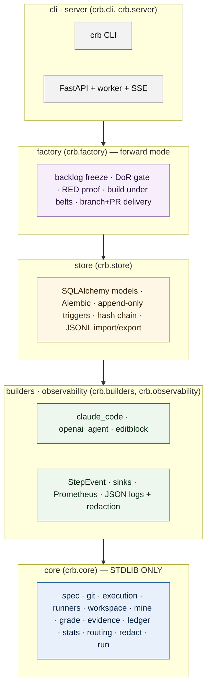
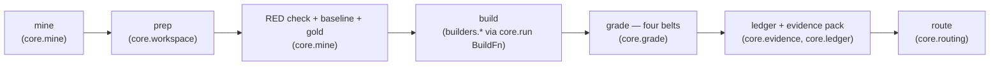

# Commit Replay Bench (`crb`)

**Commit Replay Bench** grades an AI builder against a repository's **own held-out tests**.
Its verdicts do not come from a model's opinion of a model's work: every verdict is the
result of four **mechanical belts** run over the repository's real test suite, and the
product refuses — at the moment of writing — to record a pass that any belt contradicts
(**false-Q1 = 0**, enforced in `GradeResult.__post_init__` and `GradeRow.assert_invariants`).
Every verdict is written to an **append-only, hash-chained ledger** with a per-task
**evidence pack**, and every number the product displays carries its sample size `n`, a
Wilson 95% interval, and the version of the apparatus that produced it. On that evidence
it **routes** each class of change to `deliver` / `calibrate` / `granularize` / `human`, and
— in a later phase — manufactures new work under the same governance.

> Status: **v2 reboot in progress** on branch `reboot/v2`. Phase P0 (skeleton + core engine)
> is complete; phase P1 (core hardening, fixtures, gates) is in progress. See
> [Status by phase](#status-by-phase). The June 2026 v1 contents are tagged `v1.0.0-legacy`.

Related documents: [Architecture](docs/ARCHITECTURE.md) ·
[Evidence & claims policy](docs/EVIDENCE-AND-CLAIMS.md) · [ADRs](docs/adr/README.md) ·
[Operator guide](docs/OPERATOR.md) · [Contributing](docs/CONTRIBUTING.md) ·
[Decision log](docs/DECISION-LOG.md) · [Changelog](CHANGELOG.md)

---

## Who it is for

A **regulated organisation that self-hosts it** — the design customer is an NHS
organisation. `crb` is deployed inside the customer's own tenant, **BYOK** (bring your own
model keys). Nothing leaves the tenant except the calls to the model endpoint the operator
configures (for example Azure OpenAI in the same tenant, or a local model). Repository
tests run in a **fail-closed** container sandbox with no network; test output is redacted
and capped before it is stored; raw diffs and builder transcripts are **not retained by
default**.

## What it is not

- **Not a leaderboard.** There is no public ranking and no shared score. Each deployment
  measures its own repositories, and a measured cell says nothing about a cell that was not
  measured.
- **Not an AI opinion of AI work.** No model reviews, approves or scores a change. The only
  judge is the repository's own test suite, run mechanically under the belts below. Where a
  suite is too weak to judge (a weak oracle), the product says so and routes to a human
  rather than pretending.
- **Not a proof of semantic correctness.** A green suite proves the change satisfies the
  suite. `clean` is a mechanical result. See [EVIDENCE-AND-CLAIMS](docs/EVIDENCE-AND-CLAIMS.md)
  for what may and may not be said on that basis.

---

## The four belts

A trial (the commit's parent plus the builder's edits) is `clean` **only if all four hold**
(`crb.core.grade.BELT_NAMES`):

| # | Belt | What it checks | How |
|---|------|----------------|-----|
| 1 | `tests_unmodified` | The builder did not move the goalposts. | Every target test file is **byte-identical** to the real commit's version (`git diff <sha>` + SHA-256 compare). A modified oracle **disqualifies** the trial. |
| 2 | `target_green` | The previously-RED target tests now pass. | The runner executes the target scope; timeouts are failures. |
| 3 | `no_new_failures` | Nothing else broke. | The regression belt scope is run and compared with the **baseline failing set** captured at the parent; unattributable output (compile error, crash) fails the belt. |
| 4 | `source_changed` | The pass is real, not a build-cache ghost. | The diff against the parent touches at least one non-test file. |

Everything else **fails closed**: a harness error, sandbox failure or timeout is recorded as
a non-pass, never a silent pass; a malformed oracle (a "test" file with no tests) or a
tampered test file is **disqualified** — excluded from the denominator, not counted either
way. `GradeResult.__post_init__` raises `FalseQ1Violation` if any code path tries to construct
`clean=True` with a belt that is not `True` — see [ADR-0001](docs/adr/0001-four-belts-and-false-q1-at-write.md).

## Modes: sighted and blind

| Mode | What the builder sees | Extra check |
|------|-----------------------|-------------|
| `sighted` | The parent checkout **with the target tests overlaid** (it knows what must pass). | Belt 1 proves it left them byte-identical. |
| `blind` | The parent checkout and a description only; the held-out tests are overlaid **at grade time**. | Belt 0 (blind only): if the builder touched *any* test file before the overlay, the trial is disqualified — the overlay would otherwise silently erase that edit. |

In **neither** mode does the builder see the regression belt or the grader. See
[ADR-0004](docs/adr/0004-builder-registry-sighted-and-blind.md).

## The instrument in six steps

1. **Mine** — walk the repository's history for commits that couple a source change with a
   test change within the pool's size caps (`standard` / `hard`).
2. **Prep** — create a disposable git worktree at the commit's **parent**; overlay the
   commit's test files.
3. **RED / baseline / GOLD check** — the target tests must **fail** at the parent (and not
   time out); the belt scope's pre-existing failures are recorded as the **baseline**; then
   the commit's own sources are overlaid and must turn the target green with no new belt
   failures (**gold**). A commit whose gold does not pass cannot judge a builder and is
   excluded from statistics (`gold_clean=False`).
4. **Build** — the configured builder edits a fresh worktree (sighted or blind) under a
   turn/token/cost budget. It never receives the grader.
5. **Grade** — the four belts run inside the sandbox; the result is a `GradeResult` that
   cannot be `clean` with a failed belt.
6. **Ledger** — the evidence pack is hashed; a `GradeRow` carrying that hash is chained to
   the previous row and appended (no pack ⇒ no Q1). Cell statistics and the routing rule
   read from the ledger, never from a builder's self-report.

---

## Quickstart

> The CLI surface below is the P1/P2 contract. Commands are listed in pipeline order; the
> status table says which phase delivers each one.

```bash
# Python ≥ 3.12; git on PATH; docker for the sandboxed executor.
pip install -e '.[dev]'            # or: uv venv .venv --python 3.12 && uv pip install -e '.[dev]'

crb repo add   myrepo --path /srv/repos/myrepo --language python --runner pytest \
               --sandbox-image ghcr.io/example/myrepo-toolchain:2026-09
crb repo probe myrepo              # proves the toolchain: runs a known-green scope in the sandbox
crb mine       myrepo --pool standard --target 25    # RED-check, baseline, gold-check → tasks
crb grade      myrepo --builder editblock --mode sighted   # build + four belts → evidence packs + ledger rows
crb ledger verify                  # walks the hash chain; exit 1 on any break
crb ledger stats --repo myrepo     # per-cell n, clean, point, Wilson CI, false-Q1 (must be 0), cost, latency
crb route      --repo myrepo       # the ONE routing rule applied to each measured cell, with its reason
```

Library use (stdlib only — `crb.core` imports nothing outside the standard library):

```python
from crb.core.spec import RepoConfig, Language
from crb.core.git import GitRepo
from crb.core.runners import get_runner
from crb.core.execution import DockerExecutor, DockerSettings
from crb.core.mine import mine
from crb.core.grade import grade
from crb.core.ledger import JsonlLedger, GradeRow, all_cell_stats
from crb.core.routing import route

config = RepoConfig(name="myrepo", language=Language.PYTHON, sandbox_image="myrepo-toolchain:2026-09")
executor = DockerExecutor(DockerSettings(image=config.sandbox_image))   # raises SandboxUnavailable if it cannot isolate
runner = get_runner(config)
```

## Architecture

Layers depend **downward only**; `crb.core` is standard-library only. Both rules are enforced
by `import-linter` in CI ([ADR-0008](docs/adr/0008-stdlib-core-and-downward-layers.md)).



The run pipeline, with the module that owns each stage:



`core.run` orchestrates prep → build → grade → evidence → ledger per task, one ledger row
per attempt, with the builder injected as a callable.

Full description, C4 diagrams, sequence diagrams and the data model:
[docs/ARCHITECTURE.md](docs/ARCHITECTURE.md).

## Evidence & claims policy

Every claim in this repository carries one of three tags:

| Tag | Meaning |
|-----|---------|
| `[measured]` | Backed by ledger rows you can re-derive: `n`, method, Wilson interval, apparatus version. |
| `[hypothesis]` | Directionally supported; not yet confirmed by a pre-registered or replicated measurement. |
| `[aspiration]` | Designed for; not demonstrated. |

**A number without its method is a slogan.** Every figure the product shows carries its
`n`, its confidence interval and its apparatus version; numbers from different apparatus
versions are reported separately and never blended. The full policy — the severity ladder
for false-Q1, the apparatus stamp, the legacy-belt caveat on the census ledger, and the
permitted claim shapes at each maturity — is in
[docs/EVIDENCE-AND-CLAIMS.md](docs/EVIDENCE-AND-CLAIMS.md).

## Status by phase

Phases are those of the approved product plan; each phase is a set of PRs with CI green
before the next begins.

| Phase | Scope | Status |
|-------|-------|--------|
| P0 | Reboot the repo: `crb` skeleton, `pyproject` (py ≥ 3.12), ruff / mypy / import-linter config, CI skeleton, README, ADR-0001..0003; tag `v1.0.0-legacy` on the old head | **Done** |
| P1 | Core engine (stdlib): spec / mine / workspace / runners / grade / sandbox / ledger (JSONL) / stats; per-language fixture repos; negative-controls gate; census-ledger re-derivation gate | **In progress** |
| P2 | Oracle (mutation strength, adequacy, negative controls), routing, forecast, federated export, evidence; `crb` CLI end-to-end with the `editblock` builder; `crb ledger verify` | Planned |
| P3 | Builders: `openai_agent` (Azure OpenAI, Cerebras, local), `claude_code`; budgets / escalation ladder / cost meter; sighted vs blind; tamper guard | Planned |
| P4 | Store (SQLAlchemy + Alembic, append-only triggers, hash chain, census import), FastAPI server, OIDC + local admin, RBAC, SSE, `/metrics`, JSON logs, `crb worker` | Planned |
| P5 | Observability UI (Vite / React), evidence drill-down, capability map, ledger verify / export, sign-off; builder-in-container with egress allowlist | Planned |
| P6 | Forward-mode factory: backlog freeze, DoR gate, RED proof, build under belts, branch + PR delivery, independent review with verdict-before-edit | Planned |
| P7 | Deployment (Dockerfile, compose, Helm, Azure notes), SECURITY / THREAT-MODEL, DATA-RETENTION, OPERATOR runbook, REPRODUCING-THE-CENSUS; release `v2.0.0` | Planned |

## Licence

**Apache License 2.0** ([LICENSE](LICENSE), [NOTICE](NOTICE)) — open source, with a patent
grant; chosen so that the instrument that graded a client's evidence can be read, re-run and
improved by anyone, including the client ([DECISION-LOG](docs/DECISION-LOG.md) DL-028,
[LICENSING](docs/LICENSING.md)). The v1 contents (tag `v1.0.0-legacy`) were MIT.
