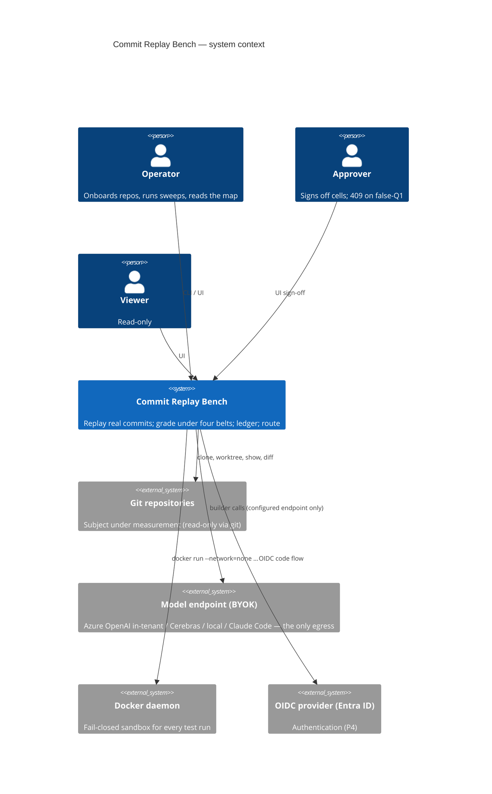
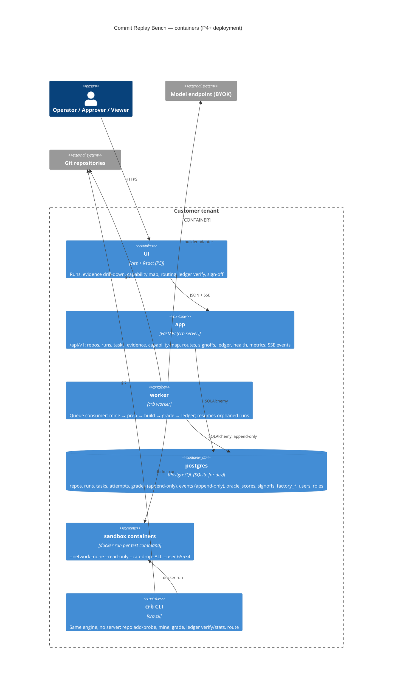
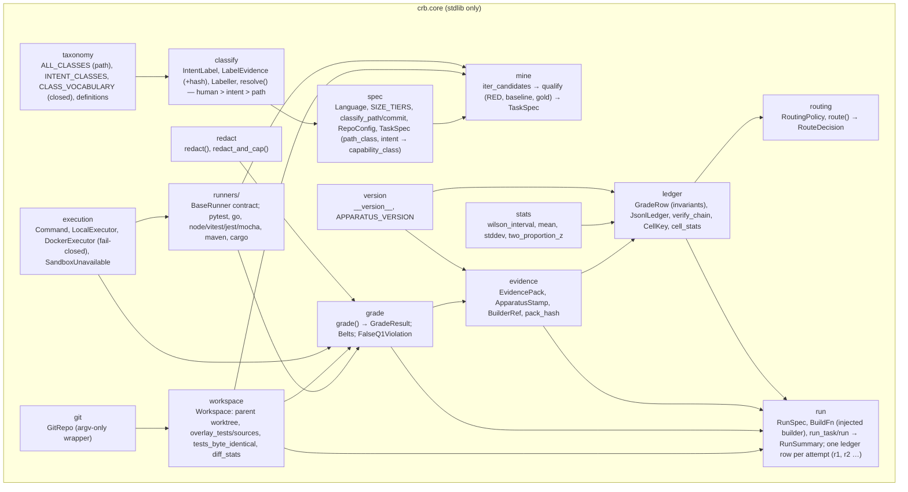
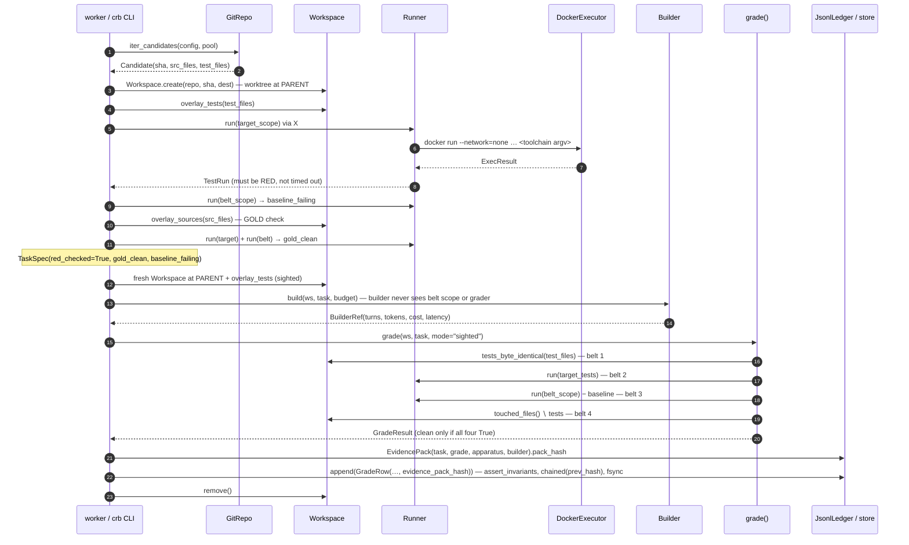
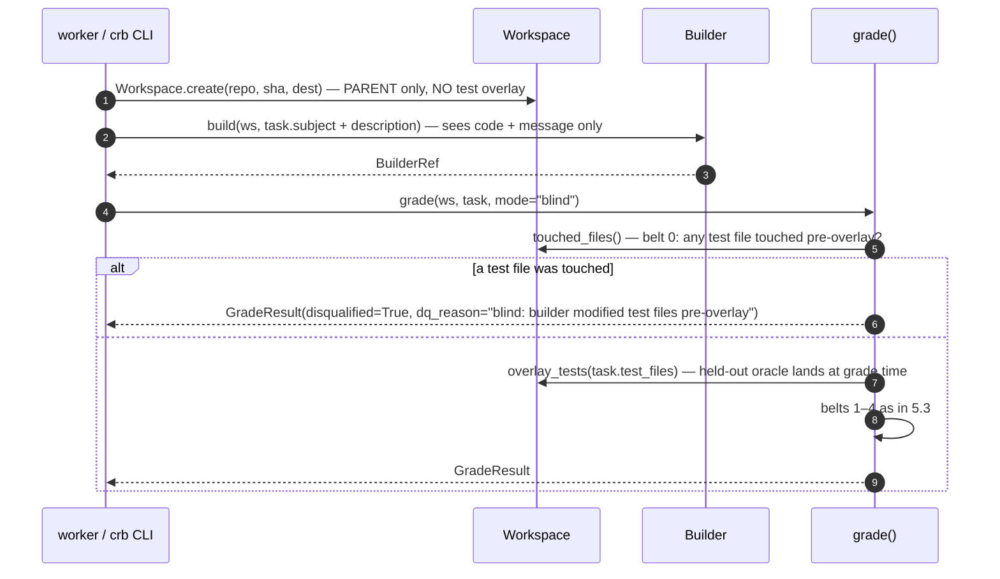
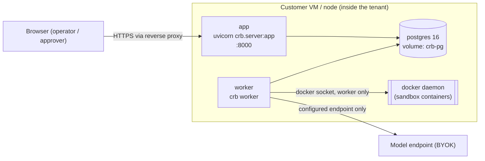

# Architecture — Commit Replay Bench (`crb`)

*arc42-lite. Source of truth is the code under `src/crb/`; where this document and the
code disagree, the code wins and this document has a bug.* Decisions are recorded as
[ADRs](adr/README.md). Claims are tagged per [EVIDENCE-AND-CLAIMS](EVIDENCE-AND-CLAIMS.md).

Contents: [1 Context & scope](#1-context--scope) · [2 Constraints](#2-constraints) ·
[3 Solution strategy](#3-solution-strategy) · [4 Building blocks](#4-building-blocks) ·
[5 Runtime views](#5-runtime-views) · [6 Deployment view](#6-deployment-view) ·
[7 Cross-cutting concepts](#7-cross-cutting-concepts) · [8 Quality scenarios](#8-quality-scenarios) ·
[9 Risks & technical debt](#9-risks--technical-debt) · [10 Glossary](#10-glossary)

---

## 1. Context & scope

`crb` answers one question for one organisation's repositories: **for which classes of
change, at which sizes, can a given AI builder be trusted to deliver — and what is the
evidence?** It does so by replaying a repository's real commits and grading the builder's
attempt against the repository's own held-out tests under four core mechanical belts plus
the repository's own lint gate where it configures one
([ADR-0001](adr/0001-four-belts-and-false-q1-at-write.md), [ADR-0011](adr/0011-repo-lint-belt.md)).

**In scope (this product):** mining replayable commits; sandboxed test execution; the
four-belt grader; evidence packs; the append-only hash-chained ledger; cell statistics; the
routing rule; oracle adequacy; a forward-mode factory that manufactures new work under the
same governance (P6); a server + UI for operators and approvers (P4–P5).

**Out of scope:** discovery / inception pipelines; SaaS multi-tenancy and billing; any
"AI review" of AI output; public leaderboards.

### External actors and systems

| Actor / system | Role |
|---|---|
| **Operator** | Onboards repositories, runs sweeps, reads the capability map, exports the ledger. |
| **Approver** | Signs off a cell for a route; sign-off is refused (HTTP 409) if the cell has any false-Q1 row. |
| **Viewer** | Read-only access to runs, evidence and the map. |
| **Admin** | Users, roles, builder/provider configuration; never sees secret values. |
| **Git repositories** | The subject under measurement; read via `git` only (no repository code is executed outside the sandbox). |
| **Model endpoint** | The only egress: Azure OpenAI in-tenant, Cerebras, a local model, or Claude Code. Configured by the operator (BYOK). |
| **Docker daemon** | Provides the fail-closed sandbox for every test run ([ADR-0005](adr/0005-fail-closed-docker-sandbox.md)). |
| **Identity provider (OIDC / Entra ID)** | Authenticates users in P4+; local admin bootstrap exists for first run. |

---

## 2. Constraints

| Constraint | Consequence | Where enforced |
|---|---|---|
| `crb.core` is **standard-library only** | The engine is auditable and embeddable with nothing but Python 3.12, `git` and (optionally) `docker`. No SDK, no ORM, no HTTP client in the grading path. | `[tool.importlinter]` forbidden contract; CI `layers` job ([ADR-0008](adr/0008-stdlib-core-and-downward-layers.md)) |
| Layers depend **downward only** (`cli\|server → factory → store → builders\|observability → core`) | A lower layer can never reach up; the grader cannot be influenced by the server or a builder. | `[tool.importlinter]` layers contract; CI |
| **Fail-closed sandbox** | If Docker cannot provide isolation, the run **stops** (`SandboxUnavailable`); tests are never run in-process as a fallback. | `crb.core.execution.DockerExecutor` ([ADR-0005](adr/0005-fail-closed-docker-sandbox.md)) |
| **Append-only ledger** with a SHA-256 hash chain | Rows cannot be edited, reordered or removed without detection; `crb ledger verify` proves it. DB triggers forbid UPDATE/DELETE in P4. | `crb.core.ledger` ([ADR-0002](adr/0002-append-only-hash-chained-ledger.md)) |
| **false-Q1 = 0 at write** | A `clean` verdict with any failed belt, a disqualification, an error or no evidence-pack hash cannot be constructed or written. | `GradeResult.__post_init__`, `GradeRow.assert_invariants` ([ADR-0001](adr/0001-four-belts-and-false-q1-at-write.md)) |
| **Zero raw retention by default** | Diffs stored as hash + stats; test output redacted and capped; builder transcripts opt-in with a retention window. | `crb.core.evidence`, `crb.core.redact` ([ADR-0006](adr/0006-zero-raw-retention-and-evidence-packs.md)) |
| **Single-organisation, multi-repo** | One deployment per organisation; no workspace/billing plumbing. RBAC: viewer / operator / approver / admin. | `crb.server` (P4) |
| **OIDC (Entra ID) + local admin bootstrap** | No home-grown password scheme beyond the bootstrap account (argon2). Cookie session. | `crb.server` (P4) |
| **Cross-organisation learning is abstract-only and opt-in** | Only `(class × size × language × step × builder × model × provider) → pass / false-Q1 / cost / latency` may leave; never code, ids or free text; k-anonymity applied; never consumed automatically. | `crb.core.federated` (P2) ([ADR-0007](adr/0007-abstract-cell-export-only.md)) |
| Python ≥ 3.12; `uv` for environments; `ruff` + `mypy --strict` + `import-linter` + `pytest --cov-fail-under=70` as gates | A change that weakens a gate is rejected in review. | `.github/workflows/ci.yml`; [CONTRIBUTING](CONTRIBUTING.md) |

---

## 3. Solution strategy

1. **Make the honest verdict the only constructible verdict.** Rather than checking for
   false passes after the fact, the data types refuse to exist in a false state
   (`FalseQ1Violation`). Everything downstream — statistics, routing, sign-off — can then
   trust `clean` without re-deriving it, and still re-derives it at read time as a belt-and-braces check.
2. **Separate the instrument from the subject.** The builder operates in a disposable
   worktree and never sees the regression belt or the grader; the grader operates on the
   worktree after the builder has finished, from a fresh checkout of the tests.
3. **Mechanical, per-language runners on one contract.** Every runner returns
   `(returncode, failing_test_ids, tail, timed_out, parse_error)`; runners never decide
   verdicts.
4. **Evidence first, numbers second.** A verdict without an evidence pack cannot be
   recorded. Statistics are computed from ledger rows, and every statistic carries `n`, a
   Wilson interval and the set of apparatus versions it drew on.
5. **One routing rule, published.** The rule that licenses auto-delivery is a small pure
   function with a versioned policy, so it can be audited and reproduced
   ([ADR-0003](adr/0003-one-routing-rule.md)).
6. **Thin, stdlib core; everything else is an adapter.** Model SDKs, ORMs and web frameworks
   live in outer layers behind protocols the core defines.

---

## 4. Building blocks

### 4.1 C4 level 1 — system context



### 4.2 C4 level 2 — containers



### 4.3 C4 level 3 — `crb.core` modules



`crb.core.run` is the stdlib orchestrator (prep → build → grade → evidence pack → ledger,
task by task). The builder is injected as a plain callable (`BuildFn`) so `crb.builders`
adapts any SDK to it without the core importing one. Every *attempt* is its own ledger row
(`trial = r1, r2, …`), so first-pass accuracy (`r1` rows only) and solve-rate-under-budget
(any clean row per task) are both derivable and never conflated.

Planned P2 additions to `crb.core`: `oracle/` (mutation strength, adequacy gate, negative
controls, sealed corpus), `forecast` (capability map, cost/latency Pareto, readiness
punch-list), `federated` (abstract-cell export).

### 4.4 Outer layers

| Package | Responsibility | Status |
|---|---|---|
| `crb.observability` | `StepEvent` envelope (`trace_id` = run, `step_id` = task, `stage ∈ mine\|prep\|build\|grade\|ledger\|oracle\|factory\|system`); `MemorySink` / `JsonlSink` / `MultiSink` / `CallbackSink`; `Emitter.on_event()` adapter for the core's `on_event` callbacks; Prometheus metrics behind a no-op fallback (`crb_false_q1_total` **must read 0**); JSON logging with redaction; health probes (toolchains, docker sandbox, builders). | Landed on `reboot/v2` (P1) |
| `crb.builders` | `Builder` protocol and registry: `claude_code`, `openai_agent`, `editblock`; budgets, escalation ladder, cost meter; sighted / blind ([ADR-0004](adr/0004-builder-registry-sighted-and-blind.md)). | P3 |
| `crb.store` | SQLAlchemy 2 models + Alembic; append-only triggers; hash chain identical to the JSONL ledger; JSONL import (census) / export. | P4 |
| `crb.factory` | Forward mode: frozen hashed backlog, DoR gate (structural gaps only), test-first RED proof, build under belts, branch + PR delivery (never the default branch), independent review with verdict-before-edit, `factory_evidence`. | P6 |
| `crb.server` | FastAPI: OIDC + local admin, RBAC, routes, SSE from the events table, `/metrics`, `/health`; `worker.py`. | P4 |
| `crb.cli` | `crb repo add\|probe · mine · run · grade · oracle · route · forecast · ledger export\|verify\|stats · factory … · worker · serve · mcp`. | P2 |
| `crb.mcp` | The API as Model Context Protocol tools (`crb mcp`, stdio): a client of `/api/v1` over HTTP — never an importer of `crb.server` — under the deployment's RBAC; sign-offs and reviews deliberately not tools ([MCP](MCP.md)). | P8 |
| `ui/` | Vite + React + TanStack Query + Tailwind. The primary nav is the **journey** — Connect (`/connect`, the guided walk; `/connect/:name` the six-stage task list derived from the API) → Results (`/results`) → Decisions (`/decisions`, the inbox of human acts) → Factory (`/factory`, the process per item with sign-a-gap / freeze / run) — and the **explore** screens behind it (runs, map, routes, oracle, learn, ledger, sign-off, settings). Three surfaces — UI, CLI, MCP — over one API and one RBAC. | P5, P9 |

---

## 5. Runtime views

### 5.1 A replay run (sighted)



### 5.2 A blind run



### 5.3 A grade (the four belts, fail-closed)

```mermaid
sequenceDiagram
    autonumber
    participant GR as grade()
    participant R as Runner
    participant WS as Workspace
    GR->>R: is_valid_oracle(root, test_file) for each target test
    alt malformed oracle
        GR-->>GR: done(disqualified=True, dq_reason="malformed oracle")
    end
    GR->>WS: tests_byte_identical(test_files)
    alt modified
        GR-->>GR: done(disqualified=True, tamper_files)
    end
    GR->>R: run(target_tests)
    alt not green (rc≠0 or timed out)
        GR-->>GR: done(clean=False, note="target not green / timed out")
    end
    GR->>R: run(belt_scope)
    Note over GR: timed_out or parse_error ⇒ no_new_failures=False (unattributable output never passes)
    GR->>GR: new = failing − baseline_failing
    GR->>WS: touched_files() − test files ⇒ source_changed
    GR-->>GR: GradeResult(clean = belts.all_true) — __post_init__ raises FalseQ1Violation otherwise
    Note over GR: any Exception ⇒ done(error=redacted) — clean=False; SandboxUnavailable propagates so the RUN stops
```

### 5.4 A sign-off refused with 409 (P4)

```mermaid
sequenceDiagram
    autonumber
    participant A as Approver (UI)
    participant S as crb.server /api/v1/signoffs
    participant ST as store
    participant RT as routing.route()
    A->>S: POST /signoffs {cell, route: "deliver"}
    S->>ST: rows for cell (append-only grades table)
    ST-->>S: GradeRow[]
    S->>S: cell_stats(rows) — re-derives clean == all recorded belts True
    alt stats.false_q1 > 0
        S-->>A: 409 Conflict {reason: "N false-Q1 row(s) in cell — evidence untrusted", rows: [...]}
        Note over S,ST: nothing is written; the 409 is itself logged as an event
    else
        S->>RT: route(stats, oracle_strength)
        RT-->>S: RouteDecision
        alt decision.route ≠ requested route
            S-->>A: 409 Conflict {reason: decision.reason, policy_version}
        else
            S->>ST: append signoff(cell, route, actor, ts, prev_hash, row_hash) — append-only, revocable by a later row
            S-->>A: 201 Created
        end
    end
```

---

## 6. Deployment view

### 6.1 Docker Compose (reference, P7)



- `app` never mounts the docker socket; only `worker` does. Tests run in **child containers**
  created by `worker` with `--network=none --read-only --cap-drop=ALL --user 65534:65534`.
- Postgres is the only stateful service; the ledger's hash chain is verified by
  `crb ledger verify` and on `/health`.
- Egress policy: `worker` → model endpoint (allowlist); `app` → OIDC provider; nothing else.

### 6.2 Helm (P7)

One chart: `Deployment` app, `Deployment` worker (with a Docker-in-Docker sidecar or a
node-level runtime socket restricted by policy), `StatefulSet`/external Postgres,
`NetworkPolicy` for the egress allowlist, `Secret` references for model keys (Key Vault CSI
on Azure). Values pin image digests. Details land with the chart.

---

## 7. Cross-cutting concepts

### 7.1 Security

| Concern | Mechanism |
|---|---|
| Untrusted repository code | Runs only inside the sandbox (§2). Host executor is for development and strips the operator's environment to an allowlist (`_HOST_ENV_PASSTHROUGH`) with process-group kill on timeout. |
| Secrets | Never in evidence packs or logs: `crb.core.redact` runs on every stored string; `DockerSettings` refuses to mount `docker.sock`, `/` or `$HOME`; builders receive keys from the environment / vault, never from config files. |
| Builder subversion of the oracle | Belt 1 byte-identity against the commit's own version; blind-mode belt 0; malformed-oracle DQ; the builder never receives the grader or belt scope. |
| Verdict tampering | `FalseQ1Violation` at construction; hash chain; DB triggers (P4); `crb ledger verify`. |
| Authentication / authorisation | OIDC + local admin bootstrap; RBAC viewer / operator / approver / admin (P4). `health` and `metrics` are network-scoped, not authenticated. |
| Supply chain | `pip-audit` on the resolved environment, CycloneDX SBOM, gitleaks, Dependabot (see `.github/`). |

A dedicated `SECURITY.md` and `THREAT-MODEL.md` land in P7.

### 7.2 Observability

Every stage emits a `StepEvent` (`crb.observability.events`): `trace_id` = run,
`step_id` = task, `stage ∈ {mine, prep, build, grade, ledger, oracle, factory, system}`,
`action` from the vocabulary in [API.md](API.md#event-vocabulary) (about a hundred
actions — `mine.candidate`, `grade.belt`, `delivery.opened`, `run.cancel_requested`, … —
each with its payload keys and consumer; `tests/test_event_vocabulary.py` keeps the table
in step with the code). Sinks: `MemorySink`, `JsonlSink`, `MultiSink`, `CallbackSink`; the
server adds an events table and SSE; the worker's emitter also feeds a metering sink.

Prometheus is two expositions, because the registry is per process: the **api** serves
`crb_http_requests_total{method, route, status}`, `crb_http_request_duration_seconds`,
`crb_ledger_rows` and `crb_false_q1_total` (recounted on every scrape; **must stay 0** — a
non-zero value is a stop condition) at `/metrics`; the **worker** serves
`crb_runs_total{kind, status}`, `crb_tasks_total{repo, outcome}`,
`crb_belt_failures_total{belt}`, `crb_builder_tokens_total{repo, builder, model, kind}`,
`crb_builder_cost_usd_total{repo, builder, model}`, `crb_grade_latency_seconds{runner}`,
`crb_build_latency_seconds{builder}`, `crb_sandbox_unavailable_total`,
`crb_deliveries_total{repo, outcome}`, `crb_github_tokens_minted_total{installation}` and
`crb_queue_depth` on its own listener (`CRB_METRICS_HOST:CRB_METRICS_PORT`, default `127.0.0.1:9464` — loopback unless the container opts in, because the series name repositories, builders and installations). The table with
meanings, the scrape targets per deployment shape and the alert rules are
[DEPLOYMENT.md §9](DEPLOYMENT.md#9-observability). JSON logs pass through the same
redaction as evidence packs (message, arguments, extras and tracebacks). `/health` runs
seven probes — `db`, `append_only`, `ledger`, `sandbox` (skipped for the api role),
`toolchains`, `builders`, `worker` (the `workers` table every worker upserts each
`heartbeat_s`, idle or not) — and `/health/live` one (`db`).

### 7.3 Data model (store, P4)

All tables carry `created` (UTC ISO-8601) and `actor`. Tables marked **append-only** have
DB triggers forbidding `UPDATE` and `DELETE`, and rows carry `prev_hash` / `row_hash`.

| Table | Key columns | Notes |
|---|---|---|
| `repos` | `name`, `language`, `runner`, `src_prefix`, `test_prefix`, `belt_scope`, `runner_opts`, `sandbox_image`, `mining` | `RepoConfig.to_dict()` shape; loads the census `configs.json` shape unchanged. |
| `runs` | `id`, `repo`, `kind ∈ setup\|probe\|mine\|replay\|blind\|oracle\|controls\|label\|factory`, `status`, `builder`, `model`, `provider`, `budget`, `apparatus` (stamp JSON), `counts` | Orphaned `running` runs are resumed by the worker, never at API boot. |
| `tasks` | `task_id` (sha), `repo`, `subject`, `authored`, `pool`, `size`, `capability_class` (resolved), `language`, `test_files`, `src_files`, `target_tests`, `belt_scope`, `baseline_failing`, `red_checked`, `gold_clean`, `gold_note`; in `spec_json` also `path_class`, `intent` (label or null), `class_source` | `TaskSpec.to_dict()` shape (§7.5). A `label` run rewrites `spec_json` + the `capability_class` column via the same upsert as `mine`. |
| `attempts` | `id`, `run_id`, `task_id`, `builder`, `mode`, `turns`, `tokens_in/out`, `cost_usd`, `latency_s`, `transcript_ref` (opt-in) | `BuilderRef` shape. |
| `grades` **(append-only)** | `row_id`, `repo`, `task_id`, `clean`, four belts, `disqualified`, `dq_reason`, `error`, `evidence_pack_hash`, `apparatus_version`, `belt_set ∈ v5\|v4\|v3-legacy`, `provenance`, cell fields, cost/latency, `actor`, `created`, `prev_hash`, `row_hash` | `GradeRow` — same invariants as the JSONL ledger, checked by a DB constraint **and** in Python before write. |
| `events` **(append-only)** | `StepEvent` envelope columns | SSE reads from here. |
| `oracle_scores` | `task_id`, `mutants`, `killed`, `invalid`, `equivalent`, `strength`, `budget`, `apparatus_version` | Hygiene-adjusted mutation strength (P2). |
| `signoffs` **(append-only)** | `cell`, `route`, `actor`, `reason`, `revoked_by` | 409 on any false-Q1 in the cell; revocation is a new row. |
| `factory_backlog` / `factory_tasks` / `factory_evidence` | frozen backlog hash; per-item DoR gaps, RED proof, PR ref, review verdict | P6. |
| `users` / `roles` | `sub` (OIDC) or local id, `role ∈ viewer\|operator\|approver\|admin` | Argon2 for the bootstrap admin only. |
| `workers` | `worker_id`, `hostname`, `executor`, `kinds`, `started`, `heartbeat`, `heartbeat_s`, `current_run_id`, `version`, `stopped` | One row per worker process, upserted every `heartbeat_s` even when idle (revision 0007). The `/health` worker probe's liveness source; a clean stop is stamped, a crash leaves the row to go stale. Mutable, no triggers. |

### 7.4 Versioning

`crb.core.version.__version__` is the package version; `APPARATUS_VERSION` (currently `2.2`) is the version of the **measuring instrument** — belt semantics, size table, class
taxonomy, routing rule. Changing any of those bumps `APPARATUS_VERSION` and needs an ADR.
Rows and packs from different apparatus versions are never blended in a claim
([EVIDENCE-AND-CLAIMS §4](EVIDENCE-AND-CLAIMS.md)).

### 7.5 Change class: two axes, one resolved value

The class axis of every cell key (`capability_class`) is **resolved** from two
independent sources, kept separately on the task so a reviewer can see which one won
(critical-friend review 2026-09-13, §4.2 reading 4 / action #5):

| Axis | Where it comes from | What it can see | Vocabulary |
|---|---|---|---|
| **Path class** (`TaskSpec.path_class`) | `crb.core.spec.classify_commit` at mine time — deterministic, free, no model | *where* the change lands: routes, models, migrations, tests, docs, CI, IaC. Any other code file is `bug.fix`, so on a library repository every task is `bug.fix`. | `ALL_CLASSES` (14, `crb.core.taxonomy`) |
| **Intent label** (`TaskSpec.intent`, an `IntentLabel`) | a `label` run (worker) / `crb tasks label-llm` through `crb.builders.labeller` — the run's `builder:model[@provider]` — or a human via `crb tasks label … --by <name>` | *what kind* of change: the commit subject, message, changed paths and per-path line counts. **Never the diff body**, so the label cannot leak the implementation into a task the same model may later replay. | `CLASS_VOCABULARY` = `ALL_CLASSES` ∪ `INTENT_CLASSES` (18): the census `class_labels.json` vocabulary (`feature.add`, `behavior.change`, `refactor`, `perf`; its `other` is `(unclassified)`) — the vocabulary the quality-floor essay's per-class numbers were measured on |

Precedence (`crb.core.classify.resolve`, deterministic and total):

```
human label (labeller "human:<name>")            → wins outright     class_source = "human"
intent label, confidence ≥ 0.70, not unclassified → wins              class_source = "intent"
otherwise                                         → the path class    class_source = "path"
```

`TaskSpec.capability_class` is *derived* at construction from `(path_class, intent)`, so
every consumer — cell key, ledger row, capability map, forecast — is unchanged. Records
from before labels existed carry `capability_class` only; on load it becomes the path
class and, with no intent, the resolved class — byte-identical to the old verdict.

Honesty properties of a label: the vocabulary is **closed** (a model answer outside it is
`(unclassified)` with confidence 0, never a new class; a human cannot invent one either);
every label stamps the sha256 of the exact evidence it was shown (`evidence_hash` =
`LabelEvidence.digest()`), so a label made on stale evidence is detectable; a transport,
auth, timeout or parse failure yields `(unclassified)`/0 with the reason in `rationale`
(the path class stands, the run continues) — never a pass; a `label` run whose every call
errored ends `failed`, not `succeeded`; a model run never overwrites a human label
(`relabel` redoes model labels only). `crb tasks classes <repo>` prints task · subject ·
path · intent · confidence · resolved · source · labeller so the review's "human-audited
sample per repo" takes minutes; `counts_json` of a `label` run carries the per-class
counts, mean confidence (with its n), the unclassified count and the labeller's cost.

Layering: `crb.core.taxonomy` (data) ← `crb.core.classify` (label, evidence, resolution,
reply parser, prompt) ← `crb.core.spec` (task spec); `crb.builders.labeller` adds the two
transports (OpenAI-compatible chat; `claude -p` with `--tools ""`, one turn, structured
output, the same `auth = api_key | cli` environment as the builder). Extending the
vocabulary changes the instrument (§7.4).

---

## 8. Quality scenarios

| Id | Quality | Scenario | Response measure |
|---|---|---|---|
| Q1 | Integrity | A builder rewrites a target test so that it passes trivially. | Belt 1 detects the byte change; the trial is **disqualified**; `tamper_files` recorded; no `clean` row can be written. |
| Q2 | Integrity | Someone edits a ledger line by hand to flip `clean` to `True`. | `crb ledger verify` fails at that row (`row_hash mismatch`); `/health` reports the chain broken; `cell_stats.false_q1 > 0` routes the cell `do_not_ship`. |
| Q3 | Safety | Docker is not running when a sweep starts. | `DockerExecutor.__init__` raises `SandboxUnavailable`; the run status becomes `blocked`; **no test runs on the host**. |
| Q4 | Safety | A repository test tries to reach the network or write outside `/tmp`. | `--network=none`, `--read-only`, tmpfs `/tmp` only; the test fails; the failure is attributed to the trial, not to the instrument. |
| Q5 | Confidentiality | A test prints `AWS_SECRET_ACCESS_KEY=…` to stdout. | `redact_and_cap` replaces it before the tail is stored in the evidence pack. |
| Q6 | Honesty | An operator asks for the "success rate" of a cell with `n = 4`. | The UI shows `n=4`, point, Wilson interval (wide), and the route `calibrate (n=4 < 10)`; no rate is shown without `n` and the interval. |
| Q7 | Auditability | An auditor asks why task X was credited clean three months ago. | The evidence pack (hash on the row) reproduces the task, belts, redacted tails, diff stats, builder ref and apparatus stamp; `verify_pack` confirms the hash. |
| Q8 | Availability | The API process restarts mid-sweep. | The worker resumes orphaned runs from the queue; the API never blocks boot on resumption. |
| Q9 | Maintainability | A contributor adds `import sqlalchemy` to `crb.core`. | `lint-imports` fails in CI (`crb.core is standard-library only`). |

---

## 9. Risks & technical debt

### 9.1 What was ported from where

| `crb` target | Ported from (AthenaClaude, read-only reference) | Treatment |
|---|---|---|
| `core.spec`, `core.mine` | `manufacture/intake/{commit_replay.CommitSpec, spec_miner}.py`, `scripts/classify_any_repo.py`, census `bench.py` mine/size | Consolidated: **one** size table; multi-file commits; Athena YAML classifications dropped. |
| `core.runners/*` | `bench.py` `py_run/go_run/js_run/jvm_run/rust_run`, `is_src/is_test`, `belt_scope_for` | Brought in-repo, host paths removed, one contract. |
| `core.grade` | `bench.py:grade`, `scripts/factorial/grade.py`, `commit_replay.grade` | **One** grader (three divergent ones upstream); four belts; DQ; fail-closed. |
| `core.execution` (Docker) | `manufacture/intake/sandbox_harness.py` | Generalised beyond pytest; fail-closed; hardening set as argv. |
| `core.ledger` | `tuning/benchmark_ledger.py` (`BenchmarkRow`, `cell_key`, `ABSTRACT_ALLOWLIST`), census `grades.jsonl` row shape | Schema superset; invariant moved from read time to **write** time; hash chain added. |
| `core.routing` | `tuning/catalog_router.py` (rule), `tuning/change_router.py` (decisions) | One rule; SPC rule demoted to advisory ([ADR-0003](adr/0003-one-routing-rule.md)). |
| `core.stats` | `manufacture/statistics.py` | Wilson, mean, stddev, two-proportion z. |
| `core.redact` | `observability/log_redaction.py` | Patterns kept; applied on every stored string. |
| `observability/*` | `observability/{step_event, step_sink, prom_metrics, json_logger, log_redaction, probes}.py` | Ported; ADR-0001 envelope kept; no-op metrics fallback. |
| `builders/openai_agent` (P3) | `manufacture/agentic_generate.py`, `scripts/model_repro_bench/gptoss_agent.py` | To merge; Azure OpenAI config. |
| `builders/claude_code` (P3) | census `wf_wave.js` prompt rules | New Python adapter. |
| `builders/editblock` (P2/P3) | `commit_replay.parse_edit_blocks/apply_edit_blocks`, v1 `generate.py` | To port. |
| `core.oracle/*` (P2) | `scripts/oracle_challenge/{mutation_strength, adequacy_gate, negative_controls}.py`, `scripts/sealed_corpus/build_corpus.py` | To port (stdlib, tested). |
| `core.forecast`, `core.federated` (P2) | `tuning/{benchmark_forecast, automation_framework, benchmark_report, federated}.py` | To port; private `self_calibrate` import dropped. |
| `factory/*` (P6) | `manufacture/delivery.py`, `manufacture/review_chain.py`, `tuning/story_readiness_bridge.py`, `t9-pilot-charter.md` loop | To port + new orchestration. |
| `store/`, `server/`, `ui/` (P4–P5) | `api/{replay_sweep_routes, sweep_executor_live}.py`, frontend tokens / `STANDARD.md` | Rebuilt against the new API. |

### 9.2 Open risks

| Risk | Impact | Mitigation / owner |
|---|---|---|
| **Oracle adequacy** — a share of repository suites is too weak to catch a wrong patch (upstream first reading: hygiene-unadjusted mutant kill-rate 58.3%, per-cell 25–76%, `[measured]` on the *upstream* apparatus, n=211 mutants). | A `clean` verdict from a weak-oracle cell certifies less than one from a strong-oracle cell. | Oracle strength travels with every number; `route()` sends `strength < 0.80` to `human`; P2 ports mutation strength + adequacy gate with invalid/equivalent-mutant hygiene. |
| **Legacy census rows** — 706 of the 1,071 census rows predate belt 4 (`belt_set=v3-legacy`). | Blending them with v4 rows would misstate the apparatus. | Reported separately; never blended ([EVIDENCE-AND-CLAIMS §5](EVIDENCE-AND-CLAIMS.md)). |
| **Contamination** — retrospective public commits may be in a model's training data. | Sighted replay overstates blind capability. | Language is always "retrospective commit-replay result"; blind mode; private repositories sidestep it; prospective validation is a later gate. |
| **Builder runs on the host in v1 of P3** (throwaway worktree). | A builder could read the host. | Builder-in-container with egress allowlist lands in P5; until then documented as `[aspiration]`. |
| **Flaky suites** | A flake can look like a regression (belt 3) or a spurious pass. | Baseline-relative belt; fixed retry policy (never rerun-until-green); flakiness recorded, not smoothed. |
| **Docker on the customer's platform** | Rootless / DinD constraints may differ. | Compose + Helm reference; fail-closed means the run stops rather than degrades. |
| **Licence** | Apache-2.0 (DL-028); contributions need a CLA/DCO before external commits. | [LICENSING](LICENSING.md). |

### 9.3 Known debt (tracked)

- `tests/` fixtures per language and the negative-controls / census-re-derivation gates are
  P1 deliverables in flight; until they land, CI coverage of `crb.core` is thin.
- `pyproject.toml` layers contract marks not-yet-existing packages optional (parenthesised);
  each package's landing PR must remove its parentheses.
- Per-language sandbox images are operator-supplied; a reference image set lands in P7.

---

## 10. Glossary

| Term | Definition |
|---|---|
| **Belt** | One of the four independent mechanical checks a trial must pass: `tests_unmodified`, `target_green`, `no_new_failures`, `source_changed`. Belt 0 is the blind-only pre-overlay tamper check. |
| **Clean** | All recorded belts `True`, not disqualified, no error, and an evidence-pack hash present. A mechanical result — not a synonym for semantic correctness. |
| **False-Q1** | A row credited `clean` that the evidence contradicts (a recorded belt not `True`). Must be 0; cannot be constructed or written. In the wider validation vocabulary, an *audited* false-Q1 is a Q1 later found to contain a material semantic defect (severity S1–S4). |
| **Cell** | The unit of measurement: `(process_step × capability_class × size × language × builder × model × provider)`. Carries no task id, repo or free text (`CellKey`). |
| **Apparatus stamp** | The record of which instrument produced a verdict: `APPARATUS_VERSION`, `crb` version, grader, runner, executor description, corpus sha, policy version. Evidence expires when its apparatus changes. |
| **Oracle adequacy** | Whether the target tests are strong enough to judge a change — measured as hygiene-adjusted mutant kill-rate on the changed lines; `< 0.80` routes to `human`. |
| **Gold** | The commit's own source change. A task is `gold_clean` when the gold turns the target green with no new belt failures; otherwise it cannot judge a builder and is excluded from statistics. |
| **RED check** | Proof that, at the parent with only the commit's tests overlaid, the target tests fail (and do not time out). A task is never assumed RED. |
| **Evidence pack** | The complete, redacted, self-describing record of one graded trial (task, grade + belts, redacted tails, diff hash + stats, builder ref, apparatus stamp); its canonical-JSON SHA-256 is the `evidence_pack_hash` on the ledger row. No pack ⇒ no Q1. |
| **Sighted / blind** | Builder modes. Sighted: target tests overlaid before the build. Blind: builder sees parent + description only; tests overlaid at grade time. Neither sees the grader. |
| **Route** | The decision the routing rule makes for a cell: `deliver`, `calibrate`, `granularize`, `human`, `do_not_ship` — with the reason and the policy version. |
| **Baseline** | The belt scope's failing set at the parent with tests overlaid; belt 3 is relative to it. |
| **Disqualified (DQ)** | Excluded from the denominator — tampered or malformed oracle. Not a fail, not a pass. |
| **Pool** | `standard` or `hard` — size caps for candidate commits (`pool_caps`). |
| **Size tier** | `XS < 10`, `S < 40`, `M < 120`, `L < 400`, `XL ≥ 400` lines of source churn — one table, stamped by the apparatus version. |
